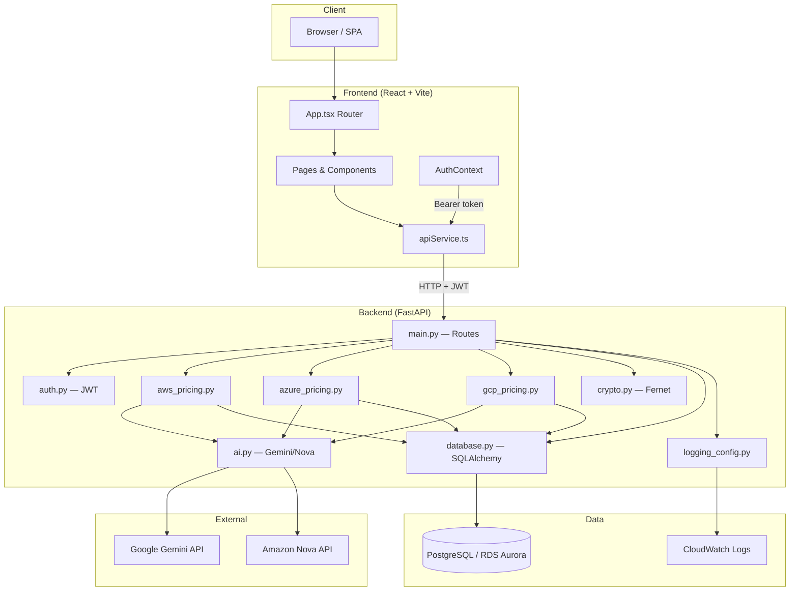
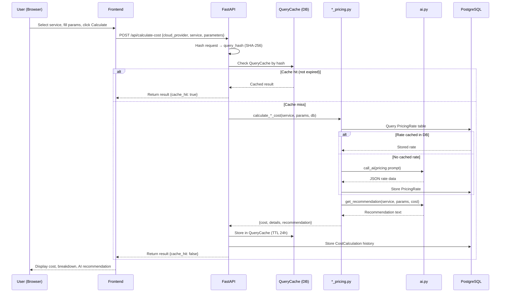
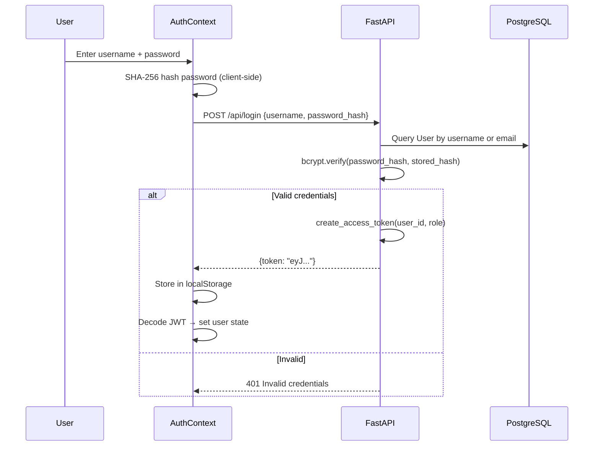
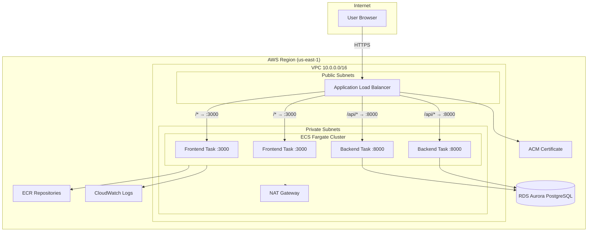
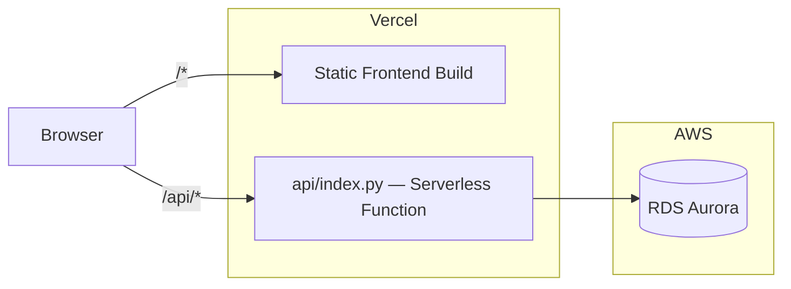
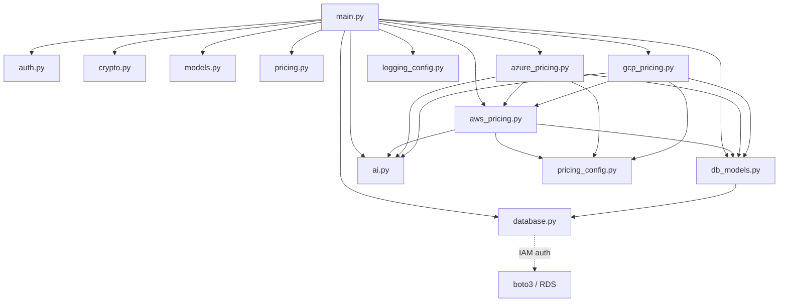

# Architecture

## High-Level Overview

CostOps AI follows a classic SPA + API architecture with three deployment targets (Vercel serverless, Docker Compose, AWS ECS Fargate).

## Request Flow — Cost Calculation

## Request Flow — Authentication

## Deployment Architecture — ECS Fargate

## Deployment Architecture — Vercel

## Module Dependency Graph

## Key Design Decisions

1. **Dual pricing source** — Pricing can come from AI (Gemini/Nova) or stub API data, switchable at runtime via `PRICING_SOURCE` env var. This allows graceful degradation when AI is unavailable.

2. **Two-layer caching** — `PricingRate` table caches raw rates per service/region. `QueryCache` table caches full calculation results (24h TTL) keyed by SHA-256 hash of the request.

3. **Client-side password hashing** — Passwords are SHA-256 hashed in the browser before transmission, then bcrypt-hashed server-side for storage. This provides defense-in-depth.

4. **Fernet encryption for credentials** — Cloud provider access keys are encrypted with Fernet (AES-128-CBC + HMAC) before storage in the database.

5. **IAM-based DB auth** — Production uses RDS IAM authentication (short-lived tokens) instead of static passwords. Falls back to password auth for local dev.

6. **Serverless + container parity** — The same FastAPI app runs on Vercel (via `api/index.py` wrapper) and in Docker/ECS containers, ensuring consistent behavior across environments.

7. **Root route redirect** — Authenticated users visiting `/` are redirected to `/overview` (the dashboard home), not the cost calculator.

8. **Admin auto-assignment** — The backend maintains an `ADMIN_EMAILS` set. Users whose email or username matches an entry are automatically assigned the `"admin"` role on signup.
