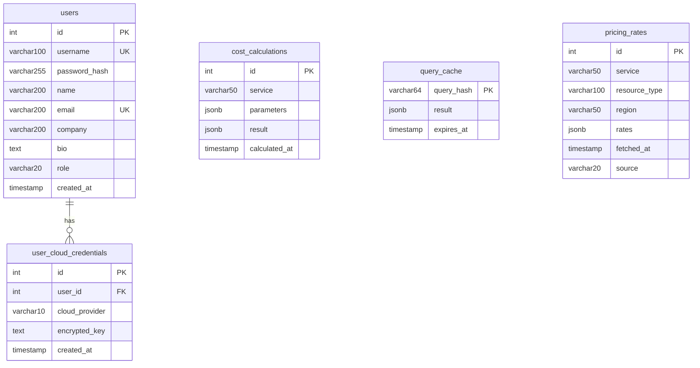

# Database Schema

PostgreSQL 15 via AWS RDS Aurora. ORM: SQLAlchemy with `declarative_base()`.

## Entity Relationship Diagram



---

## Tables

### `users`

Stores registered user accounts.

| Column | Type | Constraints | Default | Description |
|--------|------|-------------|---------|-------------|
| `id` | `Integer` | PK, indexed | auto-increment | User ID |
| `username` | `String(100)` | UNIQUE, NOT NULL, indexed | — | Login username |
| `password_hash` | `String(255)` | NOT NULL | — | bcrypt hash of SHA-256 pre-hashed password |
| `name` | `String(200)` | NOT NULL | — | Display name |
| `email` | `String(200)` | UNIQUE, NOT NULL, indexed | — | Email address |
| `company` | `String(200)` | — | `""` | Company name |
| `bio` | `Text` | — | `""` | User biography |
| `role` | `String(20)` | — | `"user"` | `"user"` or `"admin"` |
| `created_at` | `DateTime` | — | `now(UTC)` | Account creation timestamp |

**Indexes:** `id`, `username`, `email`

---

### `user_cloud_credentials`

Stores Fernet-encrypted cloud provider credentials per user.

| Column | Type | Constraints | Default | Description |
|--------|------|-------------|---------|-------------|
| `id` | `Integer` | PK, indexed | auto-increment | Credential ID |
| `user_id` | `Integer` | FK → `users.id`, NOT NULL | — | Owning user |
| `cloud_provider` | `String(10)` | NOT NULL | — | `"aws"`, `"azure"`, or `"gcp"` |
| `encrypted_key` | `Text` | NOT NULL | — | Fernet-encrypted JSON: `{access_key_id, secret_access_key}` |
| `created_at` | `DateTime` | — | `now(UTC)` | Storage timestamp |

**Constraints:** `UNIQUE(user_id, cloud_provider)` — one credential per provider per user

**Indexes:** `id`

**Cascade behavior:** When a user is deleted via `DELETE /api/admin/users/{user_id}`, all associated `user_cloud_credentials` rows are explicitly deleted before the user record is removed.

---

### `cost_calculations`

Audit log of all cost calculations performed.

| Column | Type | Constraints | Default | Description |
|--------|------|-------------|---------|-------------|
| `id` | `Integer` | PK, indexed | auto-increment | Calculation ID |
| `service` | `String(50)` | NOT NULL | — | Service name (e.g., `"ec2"`, `"blob_storage"`) |
| `parameters` | `JSONB` | NOT NULL | — | Input parameters for the calculation |
| `result` | `JSONB` | NOT NULL | — | Full calculation result including cost and details |
| `calculated_at` | `DateTime` | — | `now(UTC)` | When the calculation was performed |

**Example `parameters` JSONB:**
```json
{"instance_type": "t2.micro", "region": "us-east-1", "hours": 720, "operating_system": "linux"}
```

**Example `result` JSONB:**
```json
{"cost": 8.35, "currency": "USD", "details": {...}, "recommendation": "..."}
```

---

### `query_cache`

24-hour TTL cache for cost calculation results, keyed by SHA-256 hash of the request.

| Column | Type | Constraints | Default | Description |
|--------|------|-------------|---------|-------------|
| `query_hash` | `String(64)` | PK | — | SHA-256 hex digest of `{cloud_provider, service, parameters}` |
| `result` | `JSONB` | NOT NULL | — | Cached calculation result |
| `expires_at` | `DateTime` | NOT NULL | — | Cache expiry (created_at + 24h) |

**Cache key generation:**
```python
cache_key_data = json.dumps(
    {"cloud_provider": ..., "service": ..., "parameters": ...},
    sort_keys=True,
)
query_hash = hashlib.sha256(cache_key_data.encode()).hexdigest()
```

---

### `pricing_rates`

Cached pricing rates fetched from AI or cloud APIs.

| Column | Type | Constraints | Default | Description |
|--------|------|-------------|---------|-------------|
| `id` | `Integer` | PK, indexed | auto-increment | Rate ID |
| `service` | `String(50)` | NOT NULL, indexed | — | Service key (e.g., `"ec2"`, `"azure_virtual_machines"`, `"gcp_compute_engine"`) |
| `resource_type` | `String(100)` | NOT NULL | — | Resource identifier (e.g., `"t2.micro"`, `"standard"`, `"invocation"`) |
| `region` | `String(50)` | NOT NULL | — | Cloud region (e.g., `"us-east-1"`, `"eastus"`) |
| `rates` | `JSONB` | NOT NULL | — | Rate data (varies by service) |
| `fetched_at` | `DateTime` | — | `now(UTC)` | When the rate was fetched |
| `source` | `String(20)` | — | `"ai"` | `"ai"` or `"api"` |

**Indexes:** `id`, `service`

**Example `rates` JSONB for EC2:**
```json
{"hourly_rate_linux": 0.0116, "hourly_rate_windows": 0.0162}
```

**Example `rates` JSONB for S3:**
```json
{"per_gb_month": 0.023, "request_per_1000_get": 0.0004, "request_per_1000_put": 0.005}
```

**Service naming convention:**
- AWS: `"ec2"`, `"s3"`, `"lambda"`
- Azure: `"azure_virtual_machines"`, `"azure_blob_storage"`, `"azure_functions"`
- GCP: `"gcp_compute_engine"`, `"gcp_cloud_storage"`, `"gcp_cloud_functions"`

---

## Database Connection

The connection is configured in `backend/app/database.py` with two modes:

**IAM Authentication (production):**
- Uses `boto3` to generate short-lived RDS IAM tokens
- SSL required (`sslmode=require`)
- Pool: `pool_size=3`, `max_overflow=5`, `pool_recycle=600`

**Password Authentication (local dev):**
- Standard PostgreSQL connection string
- Pool: `pool_pre_ping=True`, `pool_recycle=300`

Tables are auto-created on application startup via `Base.metadata.create_all()`.
