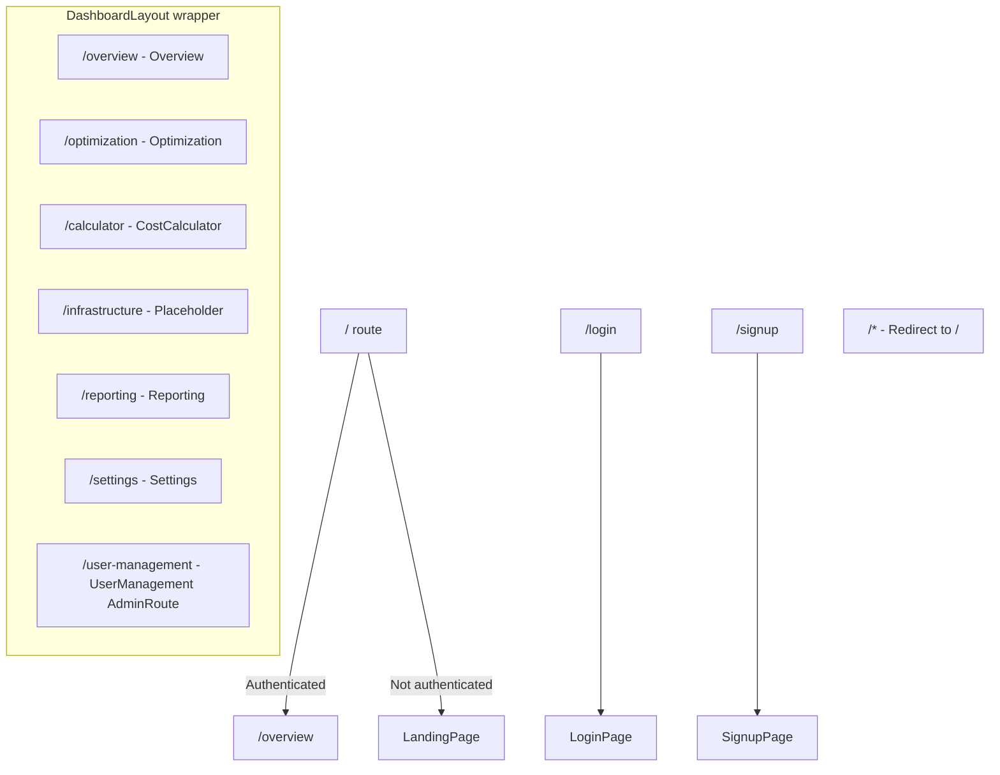

# Frontend Components

React 19 SPA built with Vite, Tailwind CSS v4, React Router v7, and Motion (Framer Motion).

## Entry Point

**`src/main.tsx`** — Renders `<App />` into `#root` with `StrictMode`.

**`index.html`** — Single HTML shell. Includes Buy Me a Coffee widget script.

---

## Routing Map (`src/App.tsx`)



| Path | Component | Layout | Auth Required | Notes |
|------|-----------|--------|---------------|-------|
| `/` | `LandingPage` or redirect | None | No | Redirects to `/overview` if authenticated |
| `/login` | `LoginPage` | None | No | Supports username or email; has loading state |
| `/signup` | `SignupPage` | None | No | Password confirmation; redirects to login on duplicate account |
| `/overview` | `Overview` | `DashboardLayout` | No | Dashboard stats |
| `/optimization` | `Optimization` | `DashboardLayout` | No | AI recommendations |
| `/calculator` | `CostCalculator` | `DashboardLayout` | No | Main cost calculator |
| `/infrastructure` | `Placeholder` | `DashboardLayout` | No | Coming soon |
| `/reporting` | `Reporting` | `DashboardLayout` | No | Reports table |
| `/settings` | `Settings` | `DashboardLayout` | No | Accessible to all authenticated users |
| `/user-management` | `UserManagement` | `DashboardLayout` | Admin | Wrapped in `AdminRoute` |
| `*` | Redirect to `/` | — | — | Catch-all |

### Provider Tree

```
<ThemeProvider>
  <AuthProvider>
    <AdminProvider>
      <Router>
        <Routes ... />
      </Router>
    </AdminProvider>
  </AuthProvider>
</ThemeProvider>
```

---

## Context Providers

### `AuthContext` (`src/context/AuthContext.tsx`)

Manages authentication state, JWT storage, and authenticated fetch.

**Interface:**
```typescript
interface AuthContextType {
  isAuthenticated: boolean;
  user: User | null;              // {user_id, role, username}
  login(username, password): Promise<void>;
  signup(username, password, name, email): Promise<void>;
  logout(): void;
  authFetch(url, options?): Promise<Response>;
}
```

**Key behaviors:**
- Passwords are SHA-256 hashed client-side via `crypto.subtle.digest()` before sending to the API
- JWT stored in `localStorage` as `auth_token`
- Token decoded client-side to extract `user_id`, `role`, `username`
- Auto-logout on token expiry (checked on mount) or 401 response
- `authFetch` automatically attaches `Authorization: Bearer` header
- Improved error handling: parses `detail` or `message` from error responses, falls back to status code message

---

### `ThemeContext` (`src/context/ThemeContext.tsx`)

Light/dark theme toggle with system preference detection.

**Interface:**
```typescript
interface ThemeContextType {
  theme: 'light' | 'dark';
  toggleTheme(): void;
}
```

**Key behaviors:**
- Reads initial theme from `localStorage('theme')` or system `prefers-color-scheme`
- Toggles `dark` class on `<html>` element
- Persists choice to `localStorage`

---

### `AdminContext` (`src/context/AdminContext.tsx`)

Controls admin feature visibility based on build-time env var.

**Interface:**
```typescript
interface AdminContextType {
  isAdmin: boolean;
}
```

**Key behaviors:**
- Reads `import.meta.env.VITE_ADMIN` at render time
- `isAdmin` is `true` only when `VITE_ADMIN === 'true'`
- Used by `AdminRoute` wrapper to gate the Settings page

---

## Layout Components

### `DashboardLayout` (`src/components/DashboardLayout.tsx`)

Main application shell with sidebar navigation, top header, and mobile menu.

**Props:** `{ children: React.ReactNode }`

**Sidebar menu items:**
| Icon | Label | Path | Visibility |
|------|-------|------|------------|
| BarChart3 | Overview | `/overview` | All users |
| TrendingDown | Optimization | `/optimization` | All users |
| Calculator | Cost Calculator | `/calculator` | All users |
| Layers | Infrastructure | `/infrastructure` | All users |
| FileText | Reporting | `/reporting` | All users |
| Settings | Settings | `/settings` | All users |
| Users | User Management | `/user-management` | Admin only (`user.role === 'admin'`) |

**Features:**
- Fixed 264px sidebar on desktop, animated slide-out on mobile
- Active route highlighting with brand color
- Top header with breadcrumb, theme toggle, notification bell, user avatar
- User avatar displays dynamic initials derived from the logged-in user's username (not hardcoded)
- Logo and brand name link to `/overview`
- User avatar navigates to `/settings` on click

---

### `ThemeToggle` (`src/components/ThemeToggle.tsx`)

Button that toggles between light (Moon icon) and dark (Sun icon) themes.

**Props:** None (uses `useTheme()` hook)

---

## Pages

### `LandingPage` (`src/pages/LandingPage.tsx`)

Marketing landing page with animated sections.

**Sections:**
1. **Navbar** — Fixed, scroll-aware, mobile hamburger menu
2. **Hero** — Headline, CTA buttons (→ `/signup`)
3. **Stats** — Monthly spend, savings, efficiency score (static)
4. **Features Grid** — 6 feature cards with icons and descriptions
5. **Optimization Preview** — Mock recommendation cards
6. **Social Proof** — Company name logos (static)
7. **Footer** — Links, copyright

**Dependencies:** `motion/react` for scroll animations, `lucide-react` for icons

---

### `LoginPage` (`src/pages/LoginPage.tsx`)

Login form with username/email and password fields.

**State:** `username`, `password`, `error`, `loading`

**Features:**
- Accepts username or email in the username field (label reads "Username or Email")
- Loading state: button shows "Signing in..." and is disabled during request
- Error messages displayed from server response with proper parsing

**Flow:** `handleLogin()` → `auth.login(username, password)` → navigate to `/overview`

---

### `SignupPage` (`src/pages/SignupPage.tsx`)

Registration form with name, email, password, confirm password.

**State:** `name`, `email`, `password`, `confirmPassword`, `error`, `loading`

**Validation:**
- Password must match confirmation
- Minimum 6 characters
- On "already exists" error, shows warning message and redirects to `/login` after 2 seconds

**Flow:** `handleSignup()` → `auth.signup(email, password, name, email)` → navigate to `/calculator`

---

### `Overview` (`src/pages/dashboard/Overview.tsx`)

Dashboard home with stats cards, cost history chart, and quick actions.

**Data fetching:** `apiService.getStats()` + `apiService.getHistory()` on mount

**Sub-components:**
- `StatCard` — Displays label, value, trend with color coding
- Bar chart — Rendered from `history.values` array as CSS-height bars
- Quick Actions — Optimize Instances, Security Audit, Budget Alerts, Usage Insights

---

### `Optimization` (`src/pages/dashboard/Optimization.tsx`)

Displays AI-generated optimization recommendations in a table.

**Data fetching:** `apiService.getRecommendations()` on mount

**Layout:**
- 3 stat cards (Active Savings, Pending Actions, Optimized Assets — static values)
- Recommendations table with title, region, estimated savings, action button

---

### `CostCalculator` (`src/pages/dashboard/CostCalculator.tsx`)

The main feature — multi-cloud cost calculator with dynamic forms.

**State management:**
- `cloudProvider` — `'aws' | 'azure' | 'gcp'`
- `service` — Service ID within the selected provider
- Per-service parameter states (instance type, region, hours, OS, storage, memory, etc.)
- `result`, `loading`, `error`

**Provider configurations (`PROVIDER_CONFIGS`):**
Each provider defines `label`, `services[]`, and `regions[]`.

**Instance/VM/Machine type lists:**
- `AWS_INSTANCE_TYPES` — 18 types (t2, t3, m5, c5, r5 families)
- `AZURE_VM_SIZES` — 11 sizes (B, D, E, F series)
- `GCP_MACHINE_TYPES` — 13 types (e2, n1, n2, c2 families)

**Flow:**
1. User selects provider → services and regions update
2. User selects service → form fields update (compute/storage/functions)
3. User fills parameters → clicks Calculate
4. `POST /api/calculate-cost` → display cost, breakdown, AI recommendation

---

### `Reporting` (`src/pages/dashboard/Reporting.tsx`)

Static reports table with download buttons.

**Data:** Hardcoded array of 5 reports (Monthly Cost Summary, Optimization Impact, etc.)

---

### `Settings` (`src/pages/Settings.tsx`)

Account settings with profile editing and cloud credential management. Accessible to all authenticated users.

**Sections:**
1. **Tab navigation** — Profile, Notifications, Security, Billing (only Profile functional)
2. **Edit Profile** — Form with name, email, company, bio. Calls `PUT /api/user/profile`
3. **Connect Cloud Accounts** — AWS, Azure, GCP credential forms. Calls `POST /api/user/connect-cloud`
4. **Preferences** — Automatic Rightsizing toggle, Optimization Frequency dropdown (UI only)

**Cloud credential flow:**
- User enters Access Key ID + Secret Access Key per provider
- On connect: `authFetch('/api/user/connect-cloud', ...)` 
- On success: fields show masked values (`••••••••••••••••`), status = "Connected"

---

### `UserManagement` (`src/pages/dashboard/UserManagement.tsx`)

Admin-only page for managing users: listing, onboarding, and deleting.

**State:** `users`, `loading`, `showOnboard`, `deleteConfirm`, `error`, `success`, `newUser`

**Features:**
- Lists all users in a table with ID, username, name, email, role, and actions
- Onboard new users via an inline form (username, email, name, password, role selector)
- Delete users with a two-step confirmation (click trash → confirm/cancel)
- Role displayed as a color-coded badge (`admin` = blue, `user` = green)

**API calls:**
- `GET /api/admin/users` — Fetch all users on mount
- `POST /api/admin/onboard-user` — Create a new user
- `DELETE /api/admin/users/{id}` — Delete a user and their credentials

**Access:** Wrapped in `AdminRoute` in `App.tsx` — non-admin users see an "Admin access required" message.

---

## API Service (`src/services/apiService.ts`)

Centralized API client with automatic auth header injection.

**Base URL:** `import.meta.env.VITE_API_BASE_URL || '/api'`

**Methods:**

| Method | HTTP | Endpoint | Auth |
|--------|------|----------|------|
| `getStats()` | GET | `/api/stats` | Bearer token |
| `getRecommendations()` | GET | `/api/recommendations` | Bearer token |
| `getHistory()` | GET | `/api/history` | Bearer token |
| `updateProfile(data)` | PUT | `/api/user/profile` | Bearer token |
| `connectCloud(data)` | POST | `/api/user/connect-cloud` | Bearer token |

**`getHeaders()`** — Returns headers with `Content-Type: application/json` and `Authorization: Bearer <token>` if a token exists in localStorage.

---

## Frontend Server (`server.ts`)

Express server that proxies API requests and serves the Vite SPA.

**Port:** 3000

**Behavior:**
- **Development:** Vite middleware mode (HMR, on-the-fly compilation)
- **Production:** Serves static files from `dist/`, SPA fallback for all routes
- **API proxy:** All `/api/*` requests forwarded to `BACKEND_URL` (default `http://localhost:8000`)
